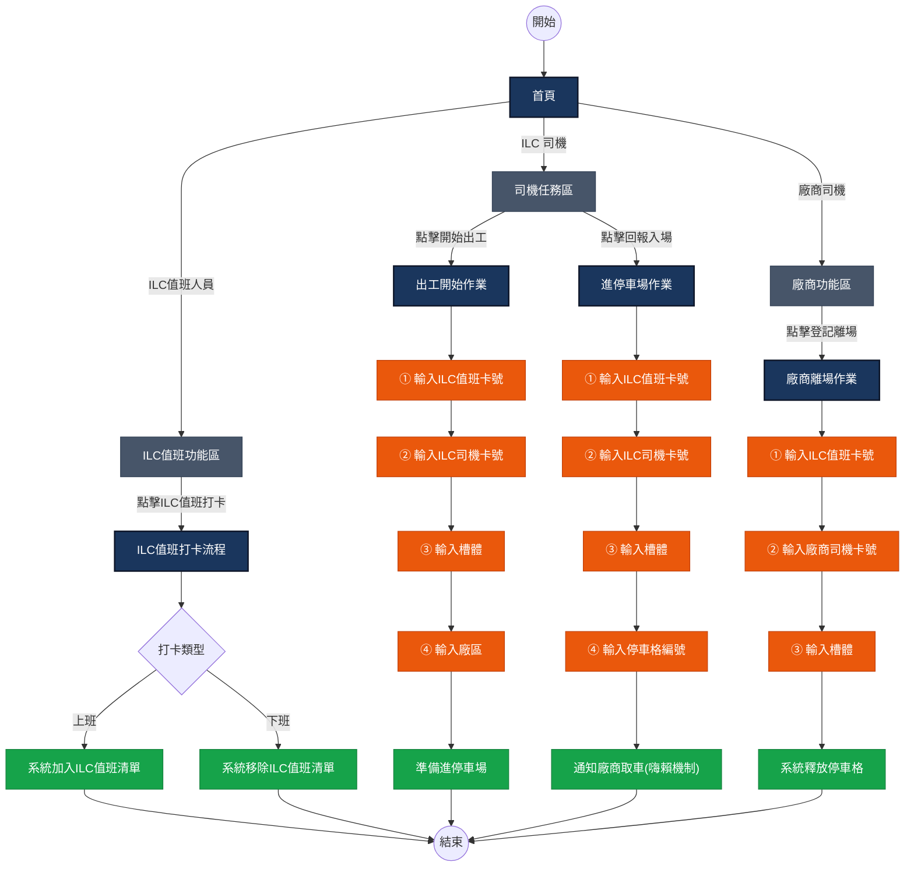

```mermaid
graph TD
    %% 樣式定義（高對比生活化配色：主流程深藍、動作橘色、系統確認綠色）
    classDef main fill:#1a365d,stroke:#0f172a,stroke-width:2px,color:#ffffff;
    classDef action fill:#ea580c,stroke:#c2410c,stroke-width:1px,color:#ffffff;
    classDef system fill:#16a34a,stroke:#15803d,stroke-width:1px,color:#ffffff;
    classDef role fill:#475569,stroke:#334155,stroke-width:1px,color:#ffffff;

    %% 畫面 1：登入
    START((開始)) --> P1[首頁]

    %% 畫面 2：分流（角色視角）
    P1 -->|ILC值班人員| R1[ILC值班功能區]:::role
    P1 -->|ILC 司機| R2[司機任務區]:::role
    P1 -->|廠商司機| R3[廠商功能區]:::role

    %% 支線 A：ILC值班打卡
    R1 -->|點擊ILC值班打卡| P6[ILC值班打卡流程]
    P6 --> A1{打卡類型}
    A1 -->|上班| A2[系統加入ILC值班清單]:::system
    A1 -->|下班| A3[系統移除ILC值班清單]:::system
    A2 & A3 --> END((結束))

    %% 支線 B：出工開始作業（ILC司機專用）
    R2 -->|點擊開始出工| P3[出工開始作業]
    P3 --> B1[① 輸入ILC值班卡號]:::action
    B1 --> B2[② 輸入ILC司機卡號]:::action
    B2 --> B3[③ 輸入槽體]:::action
    B3 --> B4[④ 輸入廠區]:::action
    B4 --> B5[準備進停車場]:::system
    B5 --> END

    %% 支線 C：進停車場作業（ILC司機專用）
    R2 -->|點擊回報入場| P4[進停車場作業]
    P4 --> C1[① 輸入ILC值班卡號]:::action
    C1 --> C2[② 輸入ILC司機卡號]:::action
    C2 --> C3[③ 輸入槽體]:::action
    C3 --> C4[④ 輸入停車格編號]:::action
    C4 --> C5["通知廠商取車(嗨賴機制)"]:::system
    C5 --> END

    %% 支線 D：廠商離場作業（廠商司機專用）
    R3 -->|點擊登記離場| P5[廠商離場作業]
    P5 --> D1[① 輸入ILC值班卡號]:::action
    D1 --> D2[② 輸入廠商司機卡號]:::action
    D2 --> D3[③ 輸入槽體]:::action
    D3 --> D4[系統釋放停車格]:::system
    D4 --> END

    %% 套用樣式
    class P1,P1,P3,P4,P5,P6 main;
```